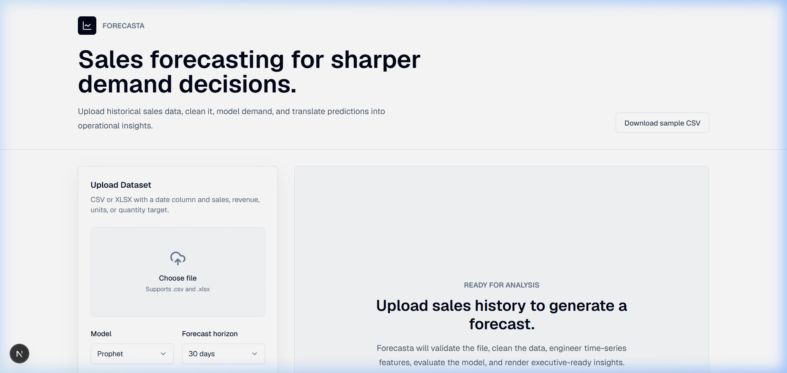
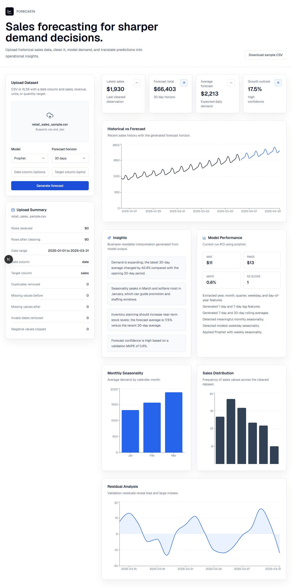

# 📊 Forecasta — Sales & Demand Forecasting Platform



**Forecasta** is a production-ready, full-stack machine learning application designed to help businesses turn historical sales data into actionable demand forecasts. 

Upload your historical data, choose a forecasting model, and let Forecasta handle the heavy lifting of data cleaning, time-series feature engineering, and statistical modeling. The result is a clean, executive-ready dashboard complete with natural language insights and error metrics.

---

## ✨ Features

- **Automated Data Cleaning:** Intelligently handles missing values, removes duplicates, infers date formats, and clips illogical negative targets.
- **Time-Series Engineering:** Automatically generates calendar fields (year, month, weekday), 1-day/7-day lags, and rolling averages to detect seasonality.
- **Multiple ML Models:** Choose between **Prophet** (Meta's time-series library), **Random Forest Regressor**, and a baseline **Linear Regression**.
- **Interactive Visualizations:** View historical vs. forecasted trends, monthly seasonality breakdowns, sales distribution, and residual analysis charts.
- **Business Insights:** Generates plain-English interpretations of the forecast (e.g., trend direction, growth outlook, inventory planning recommendations).
- **Self-Documenting API:** Fully interactive FastAPI Swagger documentation for easy integration.

---

## 🛠️ Tech Stack

| Layer | Technology |
|-------|-----------|
| **Frontend Framework** | Next.js 15 (App Router) |
| **Styling & UI** | Tailwind CSS, shadcn/ui, Recharts |
| **Backend API** | FastAPI (Python 3.10+) |
| **Machine Learning** | Prophet, Scikit-Learn, Pandas, NumPy |
| **Database** | SQLite (for run logging) |

---

## 🚀 Quick Start (Local Development)

To run Forecasta locally, you will need two terminal windows—one for the backend, one for the frontend.

### 1. Backend Setup
The backend runs on Python and FastAPI.

```powershell
cd backend
python -m venv venv
.\venv\Scripts\activate
pip install -r requirements.txt
uvicorn app.main:app --reload --host 127.0.0.1 --port 8000
```
*The API is now live at `http://127.0.0.1:8000`*

### 2. Frontend Setup
The frontend runs on Node.js and Next.js.

```powershell
cd frontend
npm install
npm run dev
```
*The dashboard is now live at `http://localhost:3000/dashboard`*

---

## 📈 Using the Application

1. Open `http://localhost:3000/dashboard` in your browser.
2. Click **Download sample CSV** to test out the platform using our 3-year realistic dataset.
3. Upload the dataset using the drag-and-drop zone.
4. Select your desired forecasting model (we recommend **Prophet**) and forecast horizon (e.g., 30 days).
5. Click **Generate forecast**.



---

## 📂 Project Structure

```text
forecasta/
├── backend/                  ← Python FastAPI application
│   ├── app/                  ← Core application logic & API routes
│   ├── services/             ← ML modeling, data cleaning, insights engine
│   └── sample_data/          ← Example CSV datasets
├── frontend/                 ← Next.js React application
│   ├── app/                  ← Dashboard pages and layouts
│   ├── components/           ← Recharts and UI components
│   └── public/               ← Static assets and sample data downloads
└── project-docs/             ← Extended documentation & screenshots
```

---

## 🌍 Production Deployment

For deploying to production, it is recommended to:
1. Run the FastAPI backend behind a reverse proxy (like Nginx) with HTTPS.
2. Build the Next.js frontend statically or deploy it to Vercel/Netlify.
3. Configure CORS policies in `backend/app/core/config.py`.
4. Swap the local SQLite database for PostgreSQL for better handling.

---

## 📜 License

This project is licensed under the MIT License. See the `LICENSE` file for more details.
